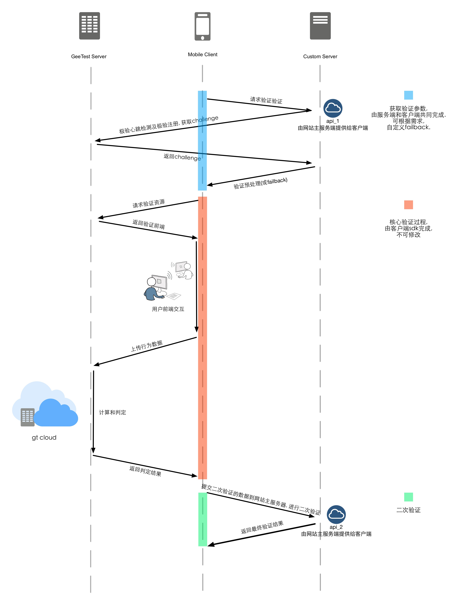
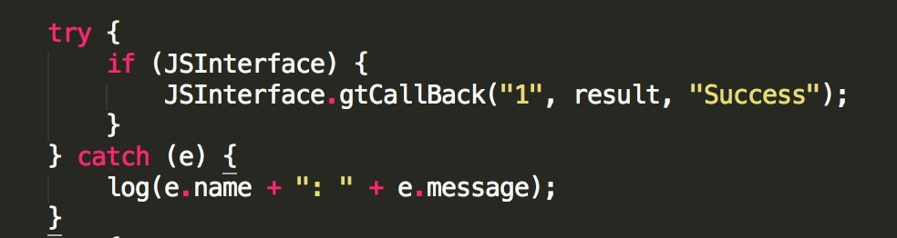
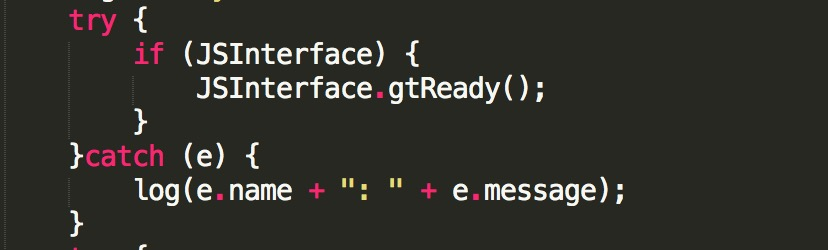

##极验验证本地客户端开发

###验证客户端工作流程



###客户端需要准备的参数
api_1
>从你们的服务端获取用于验证的id, challenge, success

>其中: 

>id:  我们验证的token, 32位字符串, 集成用户的后端提供

>challenge:  我们单次验证的流水号, 32位字符串, 集成用户的后端从我们服务器获得，然后提供给客户端

>success:  我们验证服务器的服务状态 

api_2

>客户端完成后，向你们的服务器提交seccode, 用于验证本次验证的真实性

###配置webview请求

```

http://static.geetest.com/static/appweb/app-index.html?gt=[你们的id]&challenge=[获取的challenge]&width=256

```

1. id和challenge 同上名词解释

2. width 为验证宽度，高度会自动适配

###js和客户端语言的交互

>请根据本地语言自行选择相应的技术或者接口, js直接调用本地语言

**本地语言举例objc**

```
@protocol GTCall <JSExport>

//通知native验证已准备好
- (void)gtReady;

//关闭验证界面, 在svg版本里已放弃该接口
- (void)gtCloseWindow;

//返回验证结果
- (void)gtCallBack:(JSValue *)code :(JSValue *)result :(JSValue *)message;

@end
```

其中result为用于二次验证的seccode, 字典类型

**与本地接口对应的js接口**

1. gtCallBack()



2. gtReady()




###二次验证

**是验证的重要环节之一, 不可省去**

###剩下的就是尝试走通数据通讯流程了